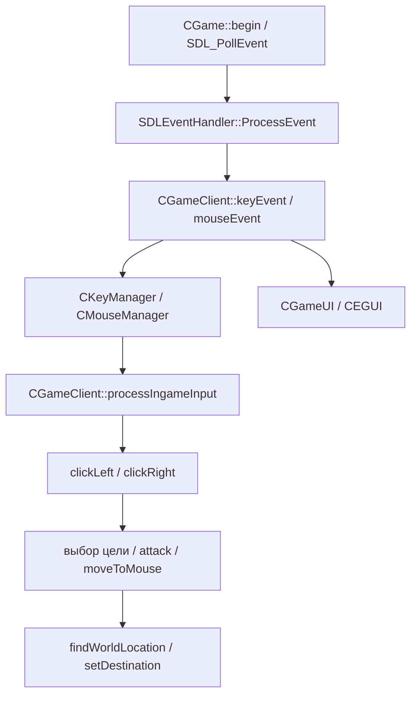

# Первый восстановленный участок: состояние ввода

## Статус и границы

Восстановлены на C++17 и сравнены с оригиналом 23 функции трёх частей ввода.
Это состояние клавиш, кнопок мыши и курсора; игровые действия, работа SDL,
CEGUI, рендерер, Android-приложение и обработка нескольких касаний ещё
не восстановлены. Количество этих небольших функций не является процентом
готовности игры.

Проверенный оригинал:
`91b41ae9dfea30aab6bc14dbbfcceaee096d600f39635b8507f5a88b5d41724b`.

## Код и адреса

| Новый модуль | Оригинальные функции | Начальные адреса |
| --- | --- | --- |
| `src/input_state.cpp` | UpdateCursorPos, GetCursorPos, SetCursorPos | `0xf63210`, `0xf63220`, `0xf63240` |
| `src/input_state.cpp` | UpdateKeyState, GetAsyncKeyState, GetKeyState, ClearKeyState | `0xf63250`, `0xf63260`, `0xf63280`, `0xf632b0` |
| `src/key_manager.cpp` | keyPressed, keyHeld, keyReleased | `0x91a670`, `0x91a680`, `0x91a6a0` |
| `src/key_manager.cpp` | capture, flushAll, flush, keyEvent | `0x91a980`, `0x91aaa0`, `0x91ab30`, `0x91ab90` |
| `src/mouse_manager.cpp` | mouseEvent, buttonPressed, buttonHeld, buttonDoubleClick | `0x91ac90`, `0x91ad20`, `0x91ad30`, `0x91ad50` |
| `src/mouse_manager.cpp` | virtualMousePosition, capture, flushAll, flush, update | `0x91ad60`, `0x91ae10`, `0x91ae70`, `0x91aea0`, `0x91aec0` |

Сигнатуры в новой библиотеке выражают восстановленную семантику. Это
не двоичная замена оригинальных C++-объектов: оригинальные смещения полей,
vtable и базовые классы в новом коде не воспроизводятся.

## Подтверждённое поведение

- Низкоуровневая таблица содержит 256 состояний. Нажатие читается как
  `0x8000` в младших 16 битах. Оба GetKeyState возвращают одинаковое
  состояние; чтение не потребляет событие нажатия.
- Координаты оригинального Linux-курсора — два 64-битных целых.
  GetCursorPos копирует их и возвращает 0. SetCursorPos возвращает 0,
  не меняя координаты. Обновление идёт через UpdateCursorPos.
- ClearKeyState очищает клавиши, сохраняя положение курсора.
- CKeyManager имеет по 512 состояний в текущем и ожидающем наборах.
  capture публикует ожидающие состояния; переходные флаги очищаются,
  удержание сохраняется. Повторный key-down не создаёт нового перехода.
- Нажатие и отпускание до capture дают одновременно pressed и released;
  held на этом кадре также истинно, поскольку включает pressed.
- flush очищает ожидающие переходы, flushAll также сбрасывает ожидающее
  удержание. Уже опубликованные флаги меняются только после capture.
- Оригинальный keyEvent опрашивает байт 57 SDL_GetKeyboardState даже
  для необрабатываемых типов сообщения. В новый код это значение передаётся
  аргументом. Оно не подменено предположением о переключённом Caps Lock.
- CMouseManager хранит три кнопки: левую, правую, среднюю. Короткое
  нажатие тоже считается удержанием на один кадр. Сообщение двойного
  клика средней кнопки `0x209` в этой сборке игнорируется.
- Колесо берётся из старших 16 бит параметра сообщения как знаковое
  значение. Накопление переполняется по модулю 2^32; capture переносит
  накопленное значение в кадр, затем обнуляет ожидающее.
- Виртуальные координаты вычисляются как float-позиция, умноженная на
  отношение целевого размера к исходному, затем обрезаются к int32.
  Оригинальный `cvttss2si` возвращает INT32_MIN при NaN, бесконечности
  и переполнении. В C++ такой результат реализован проверкой границ
  перед преобразованием, без неопределённого поведения.

Защитные отличия новой реализации: индексы вне диапазона отвергаются,
а начальные снимки кадра инициализированы нулями. Оригинальные функции
не вызываются тестом с недопустимыми индексами. Сравнение CKeyManager
начинается после capture; неинициализированное состояние его конструктора
не объявляется восстановленным поведением.

## Проверка

`tests/compare_original_input.py` проверяет SHA-256 и адреса/размеры функций,
копирует только исследованные инструкции в отдельные области памяти и
выполняет их с отдельными состояниями. Оригинальные конструкторы и загрузчик
игры не исполняются. Используется MAP_FIXED_NOREPLACE; существующие области
памяти не заменяются. Код после копирования доступен только для чтения и
исполнения. Таблица переходов мыши доступна только для чтения.

Для внешнего SDL_GetKeyboardState установлен тестовый ответ — адрес
управляемого массива клавиш. Оригинальная keyEvent исполняется целиком.
Остальные зависимости выбранных функций — исследованные функции курсора,
таблица переходов и локальные данные.

Последняя проверка Linux x86-64 с GCC:

| Участок | Сравнений и проверок | Случайных операций | Функций оригинала |
| --- | ---: | ---: | ---: |
| Клавиши и курсор | 182188 | 20000 | 7 |
| Кадры клавиатуры | 387699 | 15000 | 7 |
| Мышь и координаты | 105384 | 8000 | 9 |
| Всего | 675271 | 43000 | 23 |

Также проверены все допустимые индексы клавиш, повторные события, короткие
нажатия, 70000 событий колеса для перехода через знаковую границу,
отрицательные/большие координаты, нулевые размеры и нечисловые значения.
Все сравнения прошли. Это проверка отдельного модуля, а не работоспособности
или производительности Torchlight на Android.

## Найденные цепочки вызовов

Стрелки к processIngameInput показывают чтение состояния, а не вызов его
из менеджеров. Сложные условия и порядок выполнения ещё предстоит
восстановить. Вход блокируется/меняется в зависимости от UI, паузы,
текущей способности и других проверок; простая замена мыши стиком этого
не воспроизводит.

Для XML-команд найдены mapToFunctions, handle_onClick и виртуальная
диспетчеризация onClick. Из статической таблицы восстановлены ID 0..96.
Примеры ветвей основного HUD:

- GUIPAUSE, ID 11 → CGameUI::togglePause.
- GUITOGGLEINVENTORY, ID 72 → CGameUI::toggleInventory.
- GUIPETSELL, ID 95 → ветвь с проверками состояния питомца и sendToTown.

Найдено 24 метода onClick, включая основной HUD и специализированные меню.
Их полное соответствие отдельным layout и динамическим элементам пока
не доказано. Статические привязки и свидетельства сохранены в ui-actions.json.

В characterload.layout есть два повторно заданных onClick: у ScrollUp
и ScrollDown сначала указан guiExitApplication, затем соответствующая
команда прокрутки. Отчёт сохраняет все 115 объявлений и отмечает эти два
перекрытия; последние объявления дают 113 привязок. Это важно при переносе
интерфейса, чтобы не активировать старое перекрытое свойство.
